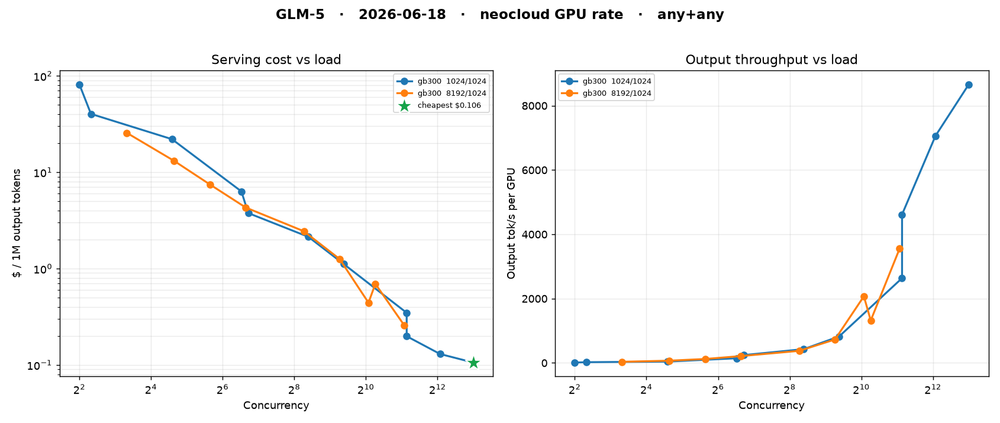

# semianalysis-cli

What does it actually cost to serve an open model?

[SemiAnalysis InferenceX](https://inferencex.semianalysis.com/inference) publishes per-GPU throughput benchmarks for open models across hardware, framework, precision, and speculative-decode method. This CLI pulls those numbers and converts throughput to `$/1M tokens` at a GPU rental rate.

```
$/1M tok = gpu_cost_per_hour * 1e6 / (tput_per_gpu * 3600)
```

computed separately for input, output, and blended total.

The CLI returns data — a Rich table, JSON, or CSV. Every JSON/CSV row carries the **full raw benchmark record** (throughput, the complete latency distribution, power/energy, parallelism config) plus the derived cost fields, so it's a clean source for downstream analysis.

## Install

```bash
pip install git+https://github.com/morphllm/semianalysis-cli.git
```

Or from a clone:

```bash
git clone https://github.com/morphllm/semianalysis-cli.git
cd semianalysis-cli
pip install -e .            # CLI only (typer, rich, requests)
pip install -e ".[plot]"   # + matplotlib, for examples/plot.py
```

## Usage

```bash
semianalysis minimax3                      # latest dynamo-sglang+MTP recipe, neocloud GPU rate
semianalysis glm5 --tier rental            # hyperscaler | neocloud | rental GPU rates
semianalysis dsv4 --hardware gb300         # restrict to one GPU
semianalysis glm5 --date all               # every benchmark date, not just latest
semianalysis kimi --framework any --spec any   # drop the recipe preference (all rows)

# Data out
semianalysis glm5 --format json --out glm5.json    # full raw records + cost, to a file
semianalysis glm5 --format csv  --out glm5.csv     # flat CSV (metrics exploded to columns)
semianalysis glm5 --json | jq '.records[].metrics.output_tput_per_gpu'
```

### Output formats

| Flag | Result |
|---|---|
| *(default)* | Rich table — one row per concurrency × ISL/OSL point, plus the cheapest-output and fastest-interactive callouts. |
| `--format json` / `--json` | JSON envelope: `{model, date, tier, framework, spec, notes, records, cheapest_output}`. Each record is the raw SemiAnalysis row + `gpu_hr`, `cost_in`, `cost_out`, `cost_total`. |
| `--format csv` | One flat row per record; `metrics.*` exploded to `metric_<name>` columns. |

`--out PATH` writes json/csv to a file instead of stdout.

### Options

| Flag | Default | Meaning |
|---|---|---|
| `--date`, `-d` | `latest` | Benchmark date (`YYYY-MM-DD`), `latest`, or `all`. `latest` is recipe-aware. |
| `--tier` | `neocloud` | GPU cost tier: `hyperscaler`, `neocloud`, or `rental`. |
| `--framework`, `-f` | `dynamo-sglang` | Serving framework filter, or `any`. |
| `--spec` | `mtp` | Speculative-decode method: `mtp`, `none`, or `any`. |
| `--hardware`, `-hw` | — | Restrict to one GPU (`gb300`, `b200`, `mi355x`, …). |
| `--format`, `-F` | `table` | `table`, `json`, or `csv`. |
| `--out`, `-o` | — | Write json/csv to this file. |
| `--limit`, `-l` | `0` | Max table rows (`0` = all; table only). |

## Plotting (standalone)

The CLI only returns data. Visualization lives in `examples/plot.py`, a standalone consumer of the JSON output — keeping the two decoupled. It renders two panels sharing the concurrency axis: **$/1M output tokens vs load** and **output throughput per GPU vs load**, one line per (hardware, ISL/OSL) series, cheapest point starred.

```bash
pip install matplotlib
semianalysis glm5 --framework any --spec any --json | python examples/plot.py -o chart.png
# or from a saved file:
semianalysis glm5 --json --out glm5.json && python examples/plot.py glm5.json -o chart.png
```



## Notes

- **Model names are exact API strings, not display tokens** (`Qwen-3.5-397B-A17B`, `DeepSeek-V4-Pro`, `MiniMax-M3`). Use the friendly aliases (`glm5`, `dsv4`, `minimax3`, `kimi`, `qwen35`, `gptoss`, …); a wrong name 400s.
- **Recipe preference, never silent fallback.** The default filter is `dynamo-sglang + MTP` (the fastest serving recipe). When a model/date has no run for it, the filter relaxes one axis at a time and prints a `fallback:` note — it never quietly swaps in worse numbers.
- **GPU rates** are SemiAnalysis's own three-tier map (Owning/Hyperscaler, Owning/Neocloud, Rental), baked into `GPU_COST` in `semianalysis_cli/core.py`. Adjust there if your rates differ.
- The SemiAnalysis API gzip-compresses every response; `requests` handles it. A bare `curl` needs `--compressed` plus a `referer: https://inferencex.semianalysis.com/inference` header.

## License

MIT
